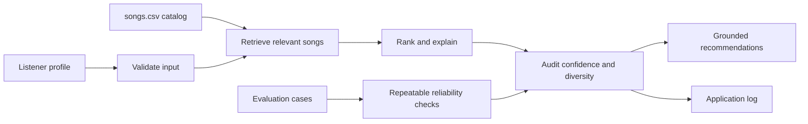

# TuneMatch: Retrieval-Augmented Music Recommender

TuneMatch is a small applied AI system that recommends songs from a local catalog based on a listener's current genre, mood, energy, and acoustic preferences. It is designed to make each recommendation inspectable: the program retrieves catalog records first, ranks that evidence with a transparent scoring rule, and reports when the catalog does not contain a strong match.

## Original Project

This project extends the **Music Recommender Simulation** from Module 3. The original version stored a ten-song catalog and a listener profile, then ranked songs by exact genre and mood matches plus energy similarity. It demonstrated that a recommendation is a set of data and weighting decisions, but it did not separate evidence retrieval from ranking or clearly communicate weak matches.

## What Changed in This Applied AI System

The new version is a retrieval-augmented recommendation pipeline. It validates the listener profile, retrieves a bounded set of relevant songs, ranks only those retrieved records, checks for artist repetition, and attaches a confidence score and catalog notes. The response is grounded in the exact song records that were retrieved; it does not invent songs or claim certainty when the catalog has no category match.

## Architecture

The full, editable system diagram is at [diagrams/architecture.mmd](diagrams/architecture.mmd). In short, the command line collects a profile, the validator checks it, the retriever selects relevant catalog records, and the ranker explains and scores those records. An audit step checks confidence and catalog coverage before results are shown. Logging and a repeatable evaluation script provide reliability evidence.



## Project Structure

```text
data/songs.csv              Small fictional music catalog
src/recommender.py          Retrieval, ranking, guardrails, and CSV validation
src/main.py                 Command-line application and logging setup
src/evaluate.py             Repeatable reliability evaluation
tests/test_recommender.py   Automated unit and guardrail tests
diagrams/architecture.mmd   Mermaid architecture source
evidence/                   Reproducible command output
model_card.md               Responsible-AI reflection and limitations
```

## Setup and Run

TuneMatch uses the Python standard library at runtime. `pytest` is needed only for the automated tests.

1. Clone this repository and open a terminal in the project folder.
2. Create and activate a virtual environment (recommended):

   ```bash
   python -m venv .venv
   # Windows PowerShell
   .venv\Scripts\Activate.ps1
   # macOS/Linux
   source .venv/bin/activate
   ```

3. Install the test dependency:

   ```bash
   python -m pip install -r requirements.txt
   ```

4. Run the default pop recommendation:

   ```bash
   python -m src.main
   ```

5. Supply a different listening session when needed:

   ```bash
   python -m src.main --genre lofi --mood chill --energy 0.4 --likes-acoustic --limit 3
   ```

The app writes activity and errors to `logs/recommender.log`. The log folder is created automatically and its contents are intentionally not committed.

## Sample Interactions

These examples can be reproduced with the commands above. Full captured output is in [evidence/sample_runs.md](evidence/sample_runs.md).

### 1. Strong pop match

```text
Profile: genre=pop, mood=happy, energy=0.80, likes_acoustic=False
Retrieved 6 catalog records | confidence: 100%

1. Sunrise City — Neon Echo (score: 6.48)
   Recommended because genre matches pop; mood matches happy; energy is very close to your target; fits your preference for less acoustic music.
```

### 2. Acoustic lofi session

```text
Profile: genre=lofi, mood=chill, energy=0.40, likes_acoustic=True
Retrieved 6 catalog records | confidence: 100%

1. Midnight Coding — LoRoom (score: 6.48)
   Recommended because genre matches lofi; mood matches chill; energy is very close to your target; fits your preference for acoustic music.
```

### 3. Preference outside the catalog

```text
Profile: genre=classical, mood=nostalgic, energy=0.50, likes_acoustic=True
Retrieved 6 catalog records | confidence: 15%

Catalog notes:
- No exact genre or mood match exists in this small catalog; these are nearest matches.
- Low confidence: try a broader genre or mood, or add songs to the catalog.
```

## Reliability and Evaluation

Run the automated tests and the scenario-based evaluation with:

```bash
python -m pytest -q
python -m src.evaluate
```

The evaluation covers three known strong matches and one deliberately missing preference. It verifies expected first choices for the strong cases and checks that the system lowers confidence and shows a warning for the catalog gap. The captured command output is stored in [evidence/evaluation_output.md](evidence/evaluation_output.md).

### Guardrails and failure handling

| Situation | System behavior |
| --- | --- |
| Empty genre or mood | Rejects the profile before retrieval. |
| Energy outside 0.0–1.0 | Rejects the profile with a clear error. |
| Malformed or empty catalog | Stops loading and writes an error to the log. |
| No matching genre or mood | Returns nearest available evidence with low-confidence notes. |
| Repeated artist in top results | Prefers a different artist first when enough candidates exist. |

## Design Decisions and Trade-offs

- **Transparent rules over a black box:** Genre, mood, energy, and acousticness are understandable to a user and easy to test. The trade-off is that the system cannot learn a person's taste from listening history.
- **Retrieve before ranking:** Separating candidate retrieval from ranking makes it clear what evidence supported an answer. With only ten songs, the retrieval step is simple; it would become more valuable with a larger catalog.
- **Confidence is catalog confidence, not a truth claim:** The value reflects how well the highest-ranked song matches the supplied profile. It cannot tell whether a person will actually enjoy a song.
- **Lightweight diversity check:** A first pass avoids repeating an artist when possible. This may place a slightly lower-scoring song ahead of another track by the same artist, which is an intentional variety trade-off.

## Limitations and Responsible Use

The catalog contains only ten fictional tracks. It has sparse genre coverage, no lyrics, no cultural or language context, and no listening history. Exact labels also fail to recognize related categories such as `pop` and `indie pop`. TuneMatch is a classroom demonstration of retrieval and ranking, not a service that should make high-stakes decisions or be presented as an authoritative description of a listener's identity or taste. More detail is in the [model card](model_card.md).

## Reflection

This project showed me that an AI system can be useful without being opaque. The important work was not only scoring songs, but also deciding what evidence to retrieve, testing expected and missing-data cases, and communicating the limits of the output. The responsible-AI collaboration reflection is in [model_card.md](model_card.md).
